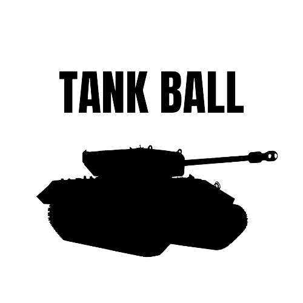
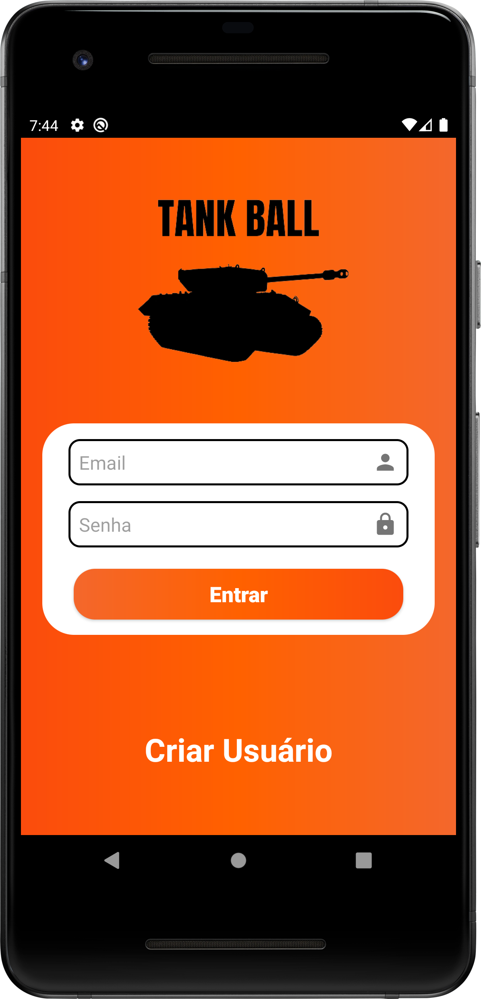
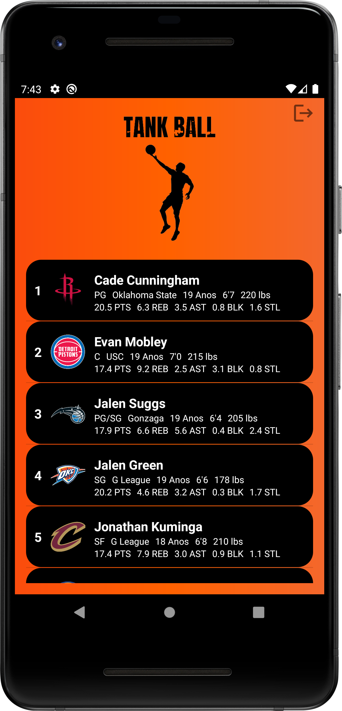
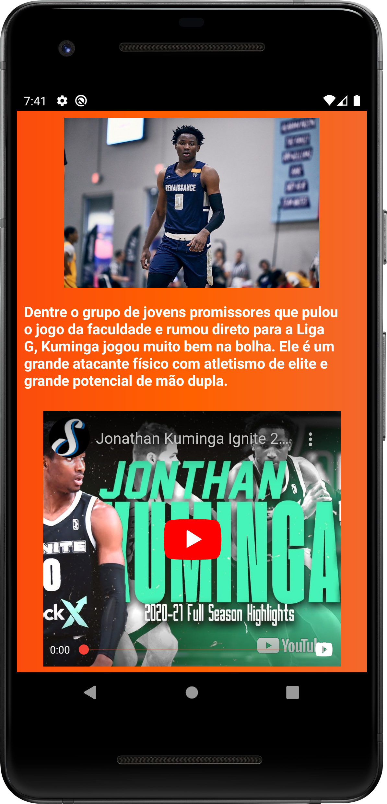

# Tank Ball

  

## ⛹️‍♂️🏀 Sobre o app

Tank Ball é um app para acompanhar o draft da NBA, fazendo as projeções e mostrando as estatísticas dos principais prospectos cotados, ranqueados de acordo com os scoutings e jornalistas.

## 📚📖 Objetivo

Desenvolvido como trabalho final da disciplina de dispositivos móveis 1, aprendendo a manusear uma RecyclerView, e utilizando um banco de dados com authentication para realizar um login.

## 👨‍💻 Tecnologias

- Java
- [Firebase](https://firebase.google.com/?authuser=0)

## 🎨 Layout e telas

  <h2>📱 Página de login</h2>
  
Página inicial para fazer login e entrar no app.

  

  <h2>📱 Página dos prospectos</h2>
  
Tela principal, onde fica ranqueado os prospectos e suas estatísticas resumidas.

  

  <h2>📱 Página de estatísticas</h2>
  
Mais detalhes sobre o jogador e um vídeo de seus melhores lances.

  

